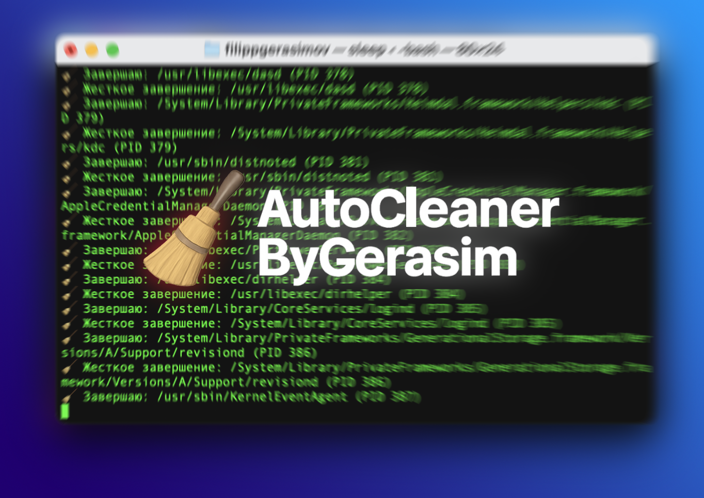

# 🧹 AutoCleanerByGerasim

[](https://github.com/Yogerasim/AutoCleanerByGerasim/stargazers)

Minimalist macOS memory cleaner that kills background processes and frees RAM — CleanMyMac-style, without subscriptions.


---

## 🧠 What it does

- Frees up memory by closing user-space apps (non-system)
- Uses Terminal and bash for full transparency
- No setup, no permissions, no installer
- Lightweight, offline, no telemetry

---

## 📥 Installation

[⬇️ Download AutoCleaner.dmg](https://github.com/Yogerasim/AutoCleanerByGerasim/releases/download/v1.0.0/AutoCleaner.dmg)

1. Download and open `.dmg`
2. Drag the app into **Applications**
3. (Optional) If the app doesn't start, follow the [quarantine removal instructions below](#-macos-quarantine-notice)

---

## 🚫 macOS Quarantine Notice

Since AutoCleaner is not yet notarized by Apple, macOS may prevent it from running after download due to **App Translocation** and **Gatekeeper quarantine**.

### ❗ If the app doesn't launch properly:

macOS might silently block it. To fix this, you need to **manually remove the quarantine flag**. Here's how:

### ✅ How to remove quarantine

1. Open **Terminal**  
   (You can find it in `Applications → Utilities → Terminal`)

2. Paste this command:

   ```bash
   sudo xattr -rd com.apple.quarantine /Applications/AutoCleaner.app
   
3. Press Enter and enter your admin password when prompted (you won't see it while typing)

4. Done! You can now launch the app normally.
💡 You only need to do this once, after installing or moving the app.
   
---

## Preview



---

## 🧾 License

This project is licensed under the [Creative Commons BY-NC-SA 4.0](https://creativecommons.org/licenses/by-nc-sa/4.0/) license.

You may:
- Use it for personal purposes
- Modify it
- Share it with attribution

You may **not**:
- Sell it
- Use it in commercial products
- Publish it as your own work

For commercial licensing, please contact: yogerrasim@gmail.com

---

## How it works

AutoCleanerByGerasim is powered by a minimalistic bash script wrapped inside a macOS `.app` via Automator.
Here’s what happens when you run it:

1. ✅ You launch the `.app`
2. 🖥 A Terminal window opens
3. 🔍 It runs:
   ```bash
   ps axo pid,comm
   ```
   ...to find all running processes

4. 🧠 It filters out critical system processes:
   Finder, Dock, loginwindow, etc.

5. 💀 It terminates all others with:
   ```bash
   kill $PID
   sleep 0.1
   kill -9 $PID (if still alive)
   ```

6. ✅ Displays “Cleanup complete!” in Terminal

This approach simulates the "Free Memory" feature from commercial tools like CleanMyMac — but in a fully transparent and scriptable way.

